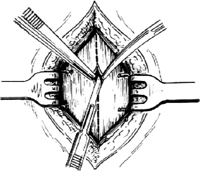
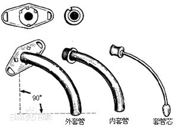
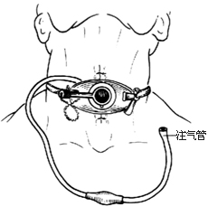
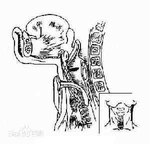
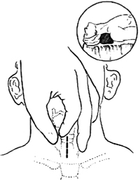

# 气管切开术
气管切开术（traceotomy）系切开颈段气管，放入金属气管套管， 气管切开术以解除喉源性呼吸困难、呼吸机能失常或下呼吸道分泌物潴留所致呼吸困难的一种常见手术。目前，气管切开有4种方法：气管切开术；经皮气管切开术；环甲膜切开术；微创气管切开术(minitracheotomy)。临床医师均应掌握这一抢救技能。

# 目录
- [历史起源](#历史起源)
- [适应症](#适应症)
	- [喉阻塞](#喉阻塞)
	- [下呼吸道分泌物潴留](#下呼吸道分泌物潴留)
	- [预防性气管切开](#预防性气管切开)
	- [取气管异物](#取气管异物)
	- [颈部外伤者](#颈部外伤者)
- [手术方法](#手术方法)
	- [常规气管切开术](#常规气管切开术)
	- [环甲膜切开术](#环甲膜切开术)
	- [经皮气管切开术](#经皮气管切开术)
	- [微创气管切开术](#微创气管切开术)
- [术后处理](#术后处理)
- [手术并发症](#手术并发症)
	- [手术并发症之一](#手术并发症之一)
	- [手术并发症之二](#手术并发症之二)
- [禁忌症](#禁忌症)

# 历史起源
最早关类似气管切开术的治疗方法的记载见于公元前2000年至1000年中的一本印度宗教经典“Riveda"(Goodall，1934)，公元2世纪时Galen和Aretaeus的著作中也提到过这种治疗方法。但是，由于解剖知识和手术经验的匮乏，其疗效很差，以至气管切开术一度被称作“外科丑闻”(Goodall，1934)。

1546年一位意大利医师，AntonioMusaBrasavola为一位“气管脓肿”患者施行了有记载的第一例成功的气管切开术(Frost，1976)。据Goodall(1934)统计，到1825年为止，医学文献中共记载了大约30例气管切开术。适应证包括从上呼吸道中取出金币和血凝块，还有为逃避绞刑而建立秘密的第二条气道的失败尝试。

19世纪中叶Trouseau(1833)报告对大约200例频于死亡的白喉患者行气管切开术，拯救了其中1/4的生命。尽管手术技术不断进步，但直到20世纪20年代，ChevalierJackson明确规定了气管切开的适应症并使手术步骤标准化以后，气管切开术才被人们广泛接受(Jackson，1937)。Jackson(1923)极力谴责其他控制气道的方法，尤其是环甲膜切开术，他认为环甲膜切开术引起的喉和声门下狭窄的发生率高得令人不能接受。

气管切开术不同时代的名称各不相同。直到18世纪，喉切开术和支气管切开术还作为同一个概念使用，就像今天的气管切开术(tracheotomy)与气管造口术(tracheostomy)一样实际上，气管切开术(tracheotomy)是“敞开气管”(Jackson，1923)，该词来自于希腊语trache arteria(粗大的管道)和tome(切割)；而气管造口术(tracheostomy)则有一个来自希腊语stoma(开口或嘴)的后缀。除非手术目的是为了形成一个永久性开口，否则正确术语应该是气管切开术tracheotomy)。

# 适应症
## 喉阻塞
由喉部炎症、肿瘤、外伤、异物等引起的严重喉阻塞

*气管切开术手术器械*

呼吸困难较明显，而病因又不能很快解除时，应及时行气管切开术。喉邻近组织的病变，使咽腔、喉腔变窄发生呼吸困难者，根据具体情况亦可考虑气管切开术。

## 下呼吸道分泌物潴留
由各种原因引起的下呼吸道分泌物潴留，为了吸痰，保持气道通畅，可考虑气管切开，如重度颅脑损伤，呼吸道烧伤严重胸部外伤，颅脑肿瘤，昏迷，神经系病变等。上述疾病时，由于咳嗽反射消失或因疼痛而不愿咳嗽，分泌物潴留于下呼吸道，妨碍肺泡气体交换，使血氧含量降低，二氧化碳浓度增高，气管切开后，吸净分泌物，改善了肺泡之气体交换。同时，术后吸入的空气不再经过咽、喉部，减少了呼吸道死腔，改善了肺部气体交换，也有利于肺功能的恢复。此外，气管切开后也为使用人工辅助器提供了方便。

## 预防性气管切开
对于某些口腔、鼻咽、颌面、咽、喉部大手术，为了进行全麻，防止血液流入下呼吸道，保持术后呼吸道通畅，可施行气管切开（目前由于气管插管术的广泛应用，预防性气管切开已较以前减少）。有些破伤风病人容易发生喉痉挛，也须考虑预防性气管切开，以防发生窒息。

## 取气管异物
气管异物经内诊镜下钳取未成功，估计再取有窒息危险，或无施行气管镜检查设备和技术者，可经气管切开途径取出异物。

## 颈部外伤者
颈部外伤伴有咽喉或气管、颈段食管损伤者，对于损伤后立即出现呼吸困难者，应及时施行气管切开；无明显呼吸困难者，应严密观察，仔细检查，作好气管切开手术的一切准备。一旦需要即行气管切开。

# 手术方法

## 常规气管切开术

术前应作好充分准备，除准备手术器械外，并应备好氧气、吸引器、

*气管切开术过程*

气管插管、或气管镜，以及各种抢救药品。对于小儿，特别是婴幼儿，术前先行插管或置入气管镜，待呼吸困难缓解后，再作气管切开，更为安全。

1．体位：一般取仰卧位，肩下垫一小枕，头后仰，使气管接近皮肤，暴露明显，以利于手术，助手坐于头侧，以固定头部，保持正中位。常规消毒，铺无菌巾。

2．麻醉：采用局麻。沿颈前正中上自甲状软骨下缘下至胸骨上窝，以1%奴夫卡因浸润麻醉，对于昏迷，危重或窒息病人，若病人已无知觉也可不予麻醉。

3．切口：多采用直切口，自甲状软骨下缘至接近胸骨上窝处，沿颈前正中线切开皮肤和皮下组织。

4．分离气管前组织：用血管钳沿中线分离胸骨舌骨肌及胸骨甲状肌，暴露甲状腺峡部，若峡部过宽，可在其下缘稍加分离，用小钩将峡部向上牵引，必要时也可将峡部夹持切断缝扎，以便暴露气管。分离过程中，两个拉钩用力应均匀，使手术野始终保持在中线，并经常以手指探查环状软骨及气管， 是否保持在正中位置。

5．切开气管：确定气管后，一般于第2～4气管环处，用尖刀片自下向上挑开2个气管环（切开4～5环者为低位气管切开术），刀尖勿插入过深，以免刺伤气管后壁和食管前壁，引起气管食管瘘。可在气管前壁上切除部分软骨环，以防切口过小，放管时将气管壁压进气管内，造成气管狭窄。

6．插入气管套管：以弯钳或气管切口扩张器，撑开气管切口，插入大小适合，带有管蕊的气管套管，插入外管后，立即取出管蕊，放入内管，吸净分泌物，并检查有无出血。

7．创口处理：气管套管上的带子系于颈部，打成死结以牢固固定。切口一般不予缝合，以免引起皮下气肿。最后用一块开口纱布垫于伤口与套管之间。

## 环甲膜切开术
对于病情危急，需立即抢救者，可先行环甲膜切开手术，待呼吸困难缓解后，再作常规气管切开术。

环甲膜切开术的手术要点：

1．于甲状软骨和环状软骨间作一长约2～4厘米的横行皮肤切口，于接近环状软骨处切开环甲膜，以弯血管钳扩大切口，插入气管套管或橡胶管或塑料管，并妥善固定。

2．手术时应避免损伤环状软骨，以免术后引起喉狭窄。

3．环甲膜切开术后的插管时间，一般不应超过24小时。

4．对情况十分紧急者，也可用粗针头经环甲膜直接刺入声门下区，亦可暂时减轻喉阻塞症状。穿刺深度要掌握恰当，防止刺入气管后壁。

## 经皮气管切开术
病人体位、皮肤消毒及铺单与传统的气管切开相同。提供的经皮导入器械包括成套的气管穿刺针和把穿刺孔扩大到合适直径的扩张器，事先应准备好气管切开托盘和插管设备。安全的手术需要3个人：手术者、助手及麻醉师。常规将一根较长的喷射通气导管(置于气管插管内的通气导管)插到气管插管内作为导引，一旦需要时即可迅速再次插人气管插管。

*环甲膜切开术*

1、一般需要镇静剂或少量麻醉药，第2、3气管环处的皮肤注射含1：100000肾上腺素的利多卡因浸润麻醉。从环状软骨下缘起垂直向下作1cm长皮肤切口。

2、将气管插管撤至顶端位于声带下。

3、将气管穿刺针以45度角斜向尾端刺入气管前壁，直到可抽出大量气体。

4、把尖端呈J形的导丝及导管插入气管，以之引导，用直径逐步增大(12—36Fr)的扩张器扩张气管开口，直到达到合适大小。

5、将气管插管通过扩张器及导丝和导管插入气管。撤出扩张器、导丝及导管，把插管缝于皮肤上。

有关术后护理与传统的气管切开术相同。

## 微创气管切开术
环甲膜前方皮肤注射l:100000肾上腺素局部麻醉药。在环甲膜上刺出1cm长的开口(曾称之为弹性圆锥切开术)，然后将一根内径4mm的套管插入气管。套管有侧翼，通过它可用系带绕过颈部固定(Minitrach II Set)(Huthinson和opkinson,1989)。

这种方法可以有效地处理术后痰潴留和肺不张。

# 术后处理
（一）床边设备：应备有氧气、吸引器、气管切开器械、导尿管及急救药品，

氧气用于气管切开，以及另一付同号气管套管。

（二）保持套管通畅：应经常吸痰，每日定时清洗内管，煮沸消毒数次。术后一周内不宜更换外管，以免因气管前软组织尚未形成窦道，使插管困难而造成意外。

（三）保持下呼吸道通畅：室内保持适当温度（22°C左右）和湿度（相对湿度90%以上），可用地上泼水、蒸气吸入，定时通过气管套管滴入少许生理盐水，0.05%糜蛋白酶等，以稀释痰液，便于咳出。

（四）防止伤口感染：由于痰液污染，术后伤口易于感染，故至少每日换药一次。如已发生感染，可酌情给以抗生素。

（五）防止外管脱出：要经常注意套管是否在气管内，若套管脱出，又未及时发现，可引起窒息。套管太短，固定带子过松，气管切口过低，颈部肿胀或开口纱布过厚等。均可导致外管脱出。

（六）拔管：俟喉阻塞或下呼吸道分泌物解除，全身情况好转后，即可考虑拔管。拔管前先堵管1~2昼夜，如病人在活动、睡眠时无呼吸困难，可在上午时间拔管。创口一般不必缝合，只须用蝶形胶布拉拢创缘，数天可自行愈合。长期带管者，由于切开部位上皮长入瘘孔内与气管粘膜愈合，形成瘘道，故应行瘘孔修补术。

# 手术并发症
## 术中并发症之一
出血：术中大出血很少见，除非罕见的高位无名动脉受到损伤。前颈静脉或甲状腺峡部引起的少量出血可以简单缝扎或用电凝控制。

心跳呼吸停止：心跳呼吸停止是致命性并发症，原因可能是迷走神经反射，也可因不能迅速建立起通畅的气道、张力性气胸、阻塞性(负压)肺水肿、给慢性二氧化碳潴留的病人吸氧或气管插管被插到软组织或主支气管内引起。对有明确慢性二氧化碳潴留病史的患者，要严密监测各项指标，术后应当立即给予机械通气。

气胸和纵隔气肿：可由于胸膜的直接损伤，空气经过软组织界面进入胸腔或纵隔，或肺大泡破裂造成。成人气管切开术后气胸和纵隔气肿发生率为0—4%(Goldstein等，1987)。儿童更常见，因为儿童胸膜顶常高于销骨。应尽可能减少气管周围的解剖，气管插管应在直视下看清楚插入气管，术后应常规拍胸片检查。

## 术后并发症之二

（一）皮下气肿：是术后最常见的并发症，与气管前软组织分离过多，气管切口外短内长或皮肤切口缝合过紧有关。自气管套管周围逸出的气体可沿切口进入皮下组织间隙，沿皮下组织蔓延，气肿可达头面、胸腹，但一般多限于颈部。大多数于数日后可自行吸收，不需作特殊处理。

（二）气胸及纵膈气肿：在暴露气管时，向下分离过多、过深，损伤胸膜后，可引起气胸。右侧胸膜顶位置较高，儿童尤甚，故损伤机会较左侧多。轻者无明显症状，严重者可引起窒息。如发现患者气管切开后，呼吸困难缓解或消失，而不久再次出现呼吸困难时，则应考虑气胸，X线拍片可确诊。此时应行胸膜腔穿刺，抽除气体。严重者可行闭式引流术。
手术中过多分离气管前筋膜，气体沿气管前筋膜进入纵隔，形成纵隔气肿。对纵隔积气较多者，可于胸骨上方沿气管前壁向下分离，使空气向上逸出。

（三）出血：术中伤口少量出血，可经压迫止血或填入明胶海绵压迫止血，若出血较多，可能有血管损伤，应检查伤口，结扎出血点。

（四）拔管困难：手术时，若节开部位过高，损伤环状软骨，术后可引起声门下狭窄。气管切口太小，置入气管套管时将管壁压入气管；术后感染，肉芽组织增生均可造成气管狭窄，造成拔管困难。此外，插入的气管套管型号偏大，亦不能顺利拔管。有个别带管时间较长的患者，害怕拔管后出现呼吸困难，当堵管时可能自觉呼吸不畅，应逐步更换小号套管，最后堵管无呼吸困难时再行拔管。对拔管困难者，应认真分析原因，行X线拍片或CT检查、直达喉镜、气管镜或纤维气管镜检查，根据不同原因，酌情处理

（五）气管食管瘘：少见。在喉源性呼吸困难时，由于气管内呈负压状态，气管后壁及食管前壁向气管腔内突出，切开气管前壁时可损伤到后壁。较小的、时间不长的瘘孔，有时可自行愈合，瘘口较大或时间较长，上皮已长入瘘口者，只能手术修补。

（六）伤口感染：气管切开是一个相对污染的清洁切口。很快院内菌株就会在伤口生长，通常为假单胞菌和大肠杆菌。因为伤口是开放性的，有利于引流，所以一般不需要预防性使用抗生素。真正发生感染极少见，而且只需局部治疗。只有当出现伤口周围蜂窝织炎时才需要抗生素治疗。

（七）管插管移位：早期插管移位或过早更换插管有引起通气障碍的危险。多层皮下筋膜、肌肉束、以及气管前筋膜彼此重叠，很容易使新形成的通道消失。如果不能立即重新找到插管的通道，应马上经口气管插管。将气管插管两侧的胸骨板(breastplate)缝于皮肤上可防止插管移位。气管切开处两端气管软骨环上留置的缝线在术后早期可以保留，一旦发生插管移位时，可帮助迅速找回插管通道。术后5—7天各层筋膜可以愈着在一起，此时更换气管插管是安全的。

（八）咽障碍：与气管切开有关的主要吞咽问题是误吸。机械因素和神经生理学因素都可以造成不正常吞咽。机械因素包括(1)喉提升能力减弱；(2)气管插管套囊压迫并阻塞食管，使食管的内容物溢入气道。神经生理学因素包括(1)喉的敏感性下降导致保护性反射消失；(2)慢性上呼吸道气体分流引起喉关闭失调。减少误吸最主要的是加强术后护理。

# 禁忌症
1、Ⅰ度和Ⅱ度呼吸困难。
2、呼吸道暂时性阻塞，可暂缓气管切开。
3、有明显出血倾向时要慎重。

